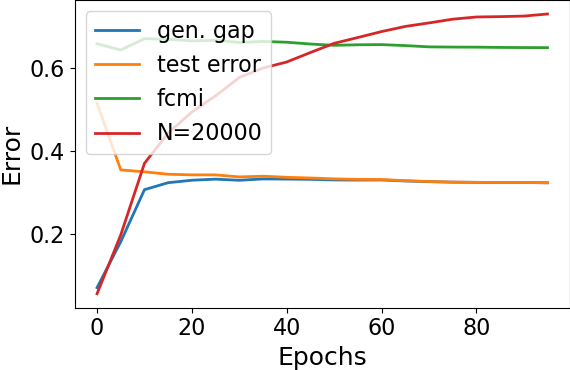

# RecogIB

## Tables for [R1 Q2]
### CIFAR10, n=1250, uniform noise

| Noise | 0.0            | 0.2            | 0.4            | 0.6            | 0.8          |
| ----- | -------------- | -------------- | -------------- | -------------- | ------------ |
| CE    | 61.00±0.72     | 68.73±1.21     | 75.65±0.51     | 81.93±0.81     | _87.42±0.94_ |
| LIMIT | 79.86±2.21     | 83.22±3.92     | 80.29±2.94     | 85.33±1.75     | 89.80±0.25   |
| RIB   | **58.66±1.13** | **66.39±2.10** | **73.14±0.54** | **80.15±1.16** | _87.42±0.70_ |

### CIFAR10, n=5000, uniform noise

| Noise | 0.0            | 0.2            | 0.4            | 0.6            | 0.8            |
| ----- | -------------- | -------------- | -------------- | -------------- | -------------- |
| CE    | 50.27±0.97     | 60.80±0.63     | 70.72±0.78     | 78.61±0.71     | 86.84±0.99     |
| LIMIT | 56.42±1.47     | 58.62±1.79     | **61.36±1.93** | **68.03±3.79** | **83.79±0.71** |
| RIB   | **47.79±0.78** | **57.29±0.67** | 67.69±0.85     | 78.25±0.85     | 87.05±0.30     |

### CIFAR10, n=20000, uniform noise

| Noise | 0.0            | 0.2            | 0.4            | 0.6            | 0.8            |
| ----- | -------------- | -------------- | -------------- | -------------- | -------------- |
| CE    | 33.10±0.94     | 47.08±0.39     | 61.88±0.47     | 75.63±1.69     | 86.77±0.56     |
| LIMIT | 32.14±0.32     | **40.12±0.55** | **49.45±0.67** | **65.52±0.70** | **83.29±1.20** |
| RIB   | **31.07±0.41** | 42.25±0.33     | 55.14±0.64     | 71.86±1.30     | 86.66±0.36     |

## Figures for [R1 Q4]
### Fashion

### SVHN

### CIFAR10

## Table for [R4 Q2]
### CIFAR10, beta=0.001, tuned from {10^n|-5≤n≤1}
| n   | 1250       | 5000       | 20000      |
| --- | ---------- | ---------- | ---------- |
| NIB | 60.20±0.74 | 50.20±0.70 | 32.21±0.36 |
| DIB | 60.72±1.12 | 49.79±0.64 | 32.49±0.41 |
